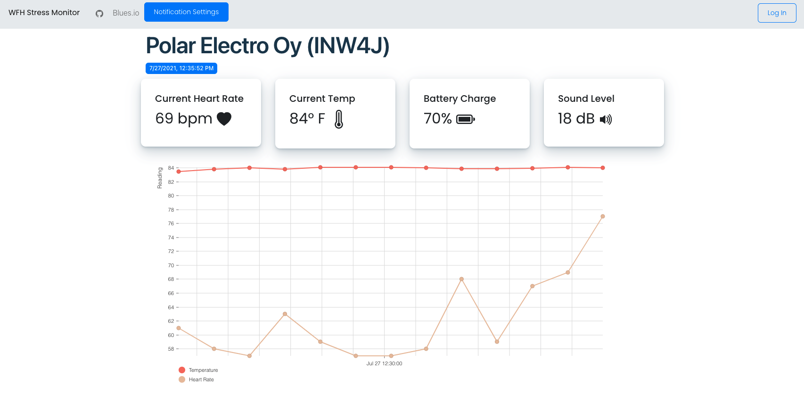

# WFH Stress Monitor

A Notecard and Bluetooth Solution for monitoring my stress levels while working from home.

This repository contains the complete source code for the following project components:

1. CircuitPython [Firmware](firmware/code.py) for the Adafruit BLE Sense.
2. Azure Serverless [Functions](functions/) for saving health data, retrieving data, and working with Environment Variables.
3. A Svelte-based [Dashboard](dashboard/) application for displaying health data and updating environment variables.